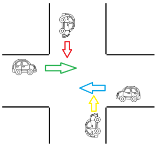

# 1º Exercício de Semáforos
Simula um cruzamento de carro com semáforo

## Descrição do exercício
Fazer uma aplicação que gerencie a figura abaixo:  
  
Para tal, usar uma variável sentido, que será alterado pela Thread que controla cada carro com a movimentação do carro. Quando a Thread tiver a possibilidade de ser executada, ela deve imprimir em console o sentido que o carro está passando. Só pode passar um carro por vez no cruzamento.
